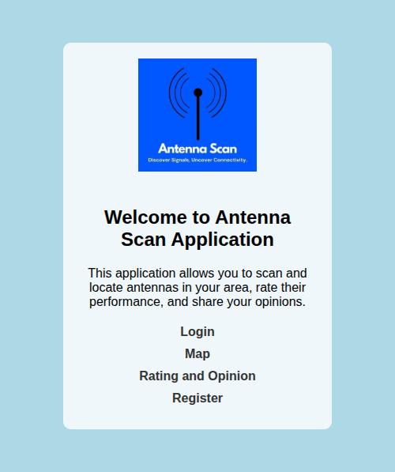
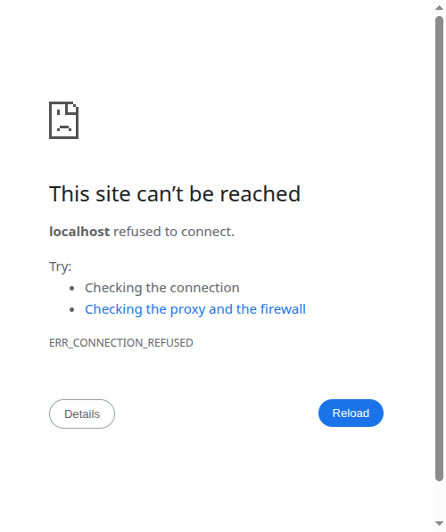
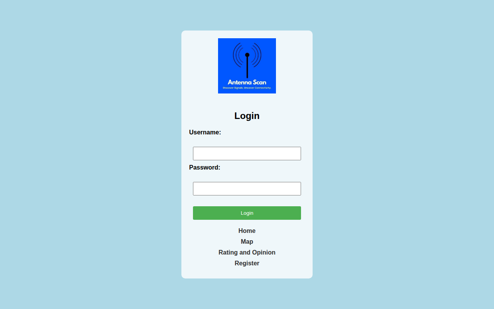
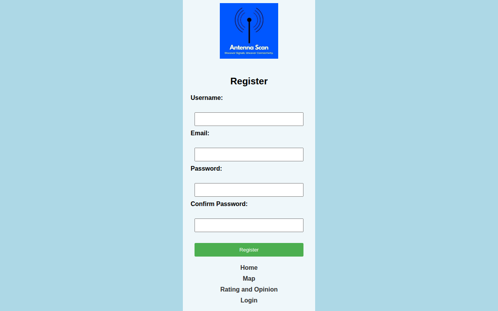

# Antenna Scan GIS Project

[](https://opensource.org/licenses/MIT)

מיפוי אנטנות סלולריות בישראל — פרויקט GIS לאיתור ומיקום אנטנות.
ריכוז מידע ממקורות שונים (מינהל הקרינה הסביבתית) בממשק ידידותי ואינטראקטיבי.

---

## צילומי מסך

### דף בית


### מפת אנטנות (8,076 אנטנות + clustering + פילטרים)


### דירוג ומשוב


### התחברות


### הרשמה


### הרשמה הצליחה


---

## תכונות

- **דף בית** — כניסה לאפליקציה
- **Login / Register** — התחברות והרשמה (כולל דף אישור)
- **Map** — מפת אנטנות אינטראקטיבית עם:
  - **Marker Clustering** — אגירת 8,076 נקודות לביצועים מיטביים
  - **סרגל סטטיסטיקות** — לפי חברה, רמת קרינה, ו-10 ערים מובילות
  - **פילטרים** — לפי חברה, רמת קרינה, עיר (עם autocomplete)
  - **Popup מפורט** — כולל טכנולוגיה, תאריכי היתר, קישורים למסמכים
  - **שכבות מפה** — Street Map / Satellite
- **Rating and Opinion** — דירוג ומשוב עם:
  - דירוג כוכבים אינטראקטיבי (1–5)
  - שמירת ביקורות ב-localStorage
  - תצוגת ביקורות קהילתיות

---

## טכנולוגיות

- **HTML · CSS · JavaScript**
- **Leaflet.js** — מפות אינטראקטיביות
- **Leaflet.markercluster** — clustering ביצועי
- **Leaflet-Control-Geocoder** — חיפוש מיקום
- **OpenStreetMap / Esri Satellite** — שכבות מפה

---

## הרצה

```bash
# שרת מקומי
python3 -m http.server 8000
# פתחי בדפדפן: http://localhost:8000/Home.html
```

---

## קבצים עיקריים

| קובץ | תיאור |
|------|-------|
| `Home.html` | דף בית |
| `login.html` | התחברות |
| `Register.html` | הרשמה |
| `registration_success.html` | אישור הרשמה |
| `map.html` | מפת אנטנות |
| `rating_opinion.html` | דירוג ומשוב |
| `DATA_converted.json` | נתוני אנטנות (8,076 רשומות) |

---

## נתונים

הנתונים מקורם ממינהל הקרינה הסביבתית — משרד הסביבה ישראל.
כל אנטנה כוללת: מיקום GPS, חברה, סוג אתר, עוצמת קרינה, תאריכי היתר, ומסמכים רשמיים.

---

## מסמך פרויקט

- `cellular antennas mapping - GIS project - Hila Mendelson.pdf`

---

© Hila · GIS Project

---

## 🇮🇱 תיעוד בעברית

### מה הפרויקט עושה

פרויקט GIS אינטראקטיבי למיפוי **8,076 אנטנות סלולריות** בישראל, המציג את הנתונים על גבי מפת Leaflet אינטראקטיבית.

הנתונים מקורם ממינהל הקרינה הסביבתית של משרד הסביבה הישראלי. כל אנטנה ברשימה כוללת מיקום GPS, שם החברה, סוג האתר, עוצמת הקרינה, תאריכי היתר וקישורים למסמכים רשמיים.

**מטרת הפרויקט:** לאפשר לציבור גישה נוחה ושקופה למידע על אנטנות קרינה בסביבתם, עם כלי סינון, חיפוש וסטטיסטיקות מפורטות.

### טכנולוגיות

- **HTML, CSS, JavaScript** — ללא framework, פיתוח web טהור
- **Leaflet.js** — מפות אינטראקטיביות
- **Leaflet.markercluster** — קיבוץ 8,076 נקודות לביצועים מיטביים
- **Leaflet-Control-Geocoder** — חיפוש כתובת/מיקום
- **OpenStreetMap** — שכבת מפה בסיסית
- **Esri Satellite** — שכבת לוויין
- **localStorage** — שמירת ביקורות ודירוגים בדפדפן

### הוראות התקנה והפעלה

אין צורך בהתקנה — האפליקציה פועלת ישירות בדפדפן.

**הרצה עם שרת Python מקומי:**

```bash
# הרץ מתוך תיקיית הפרויקט
python3 -m http.server 8000

# פתח בדפדפן:
# http://localhost:8000/Home.html
```

**ניווט בין הדפים:**
1. `Home.html` — דף כניסה ראשי
2. `login.html` — התחברות
3. `Register.html` — הרשמה חדשה
4. `map.html` — מפת האנטנות המלאה עם פילטרים וסטטיסטיקות
5. `rating_opinion.html` — דירוג ומשוב קהילתי

### מבנה הפרויקט

```
Antenna_Scan_GIS_Project/
├── Home.html                    # דף בית
├── login.html                   # התחברות
├── Register.html                # הרשמה
├── registration_success.html    # אישור הרשמה
├── map.html                     # מפת האנטנות הראשית
├── rating_opinion.html          # דירוג ומשוב
├── DATA_converted.json          # נתוני 8,076 אנטנות (GPS, חברה, קרינה, מסמכים)
├── logo.jpg                     # לוגו הפרויקט
└── screenshots/                 # צילומי מסך לתיעוד
```

**תכונות מפת האנטנות:**
- **Marker Clustering** — 8,076 נקודות מקובצות לביצועים מהירים
- **סרגל סטטיסטיקות** — פירוט לפי חברה, רמת קרינה, ו-10 ערים מובילות
- **פילטרים** — סינון לפי חברה, רמת קרינה ועיר (עם השלמה אוטומטית)
- **Popup מפורט** — לחיצה על אנטנה מציגה טכנולוגיה, תאריכי היתר וקישורים למסמכים
- **שכבות מפה** — מעבר בין Street Map ולוויין (Satellite)
